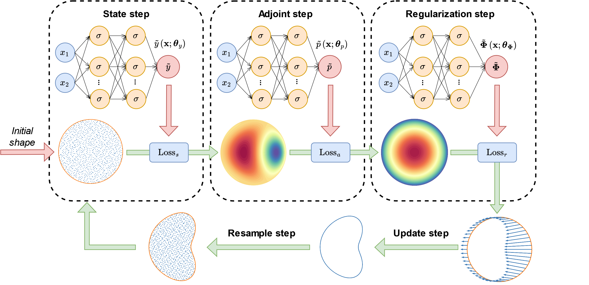
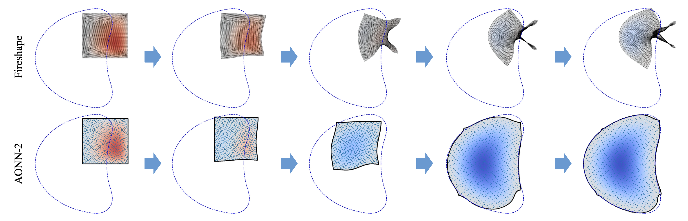

# AONN-2: An adjoint-oriented neural network method for PDE-constrained shape optimization

Official implementation of [AONN-2: An adjoint-oriented neural network method for PDE-constrained shape optimization](https://doi.org/10.1016/j.jcp.2024.113160)




# Requirements

PyTorch, 
Numpy, 
Scipy,
pyDOE


# Train

```bash
cd src
python aonn2.py
```




# Citation

If you find this repo useful for your research, please consider to cite our paper on Journal of Computational Physics
```
@article{wang2024aonn,
  title={AONN-2: {A}n adjoint-oriented neural network method for {PDE}-constrained shape optimization},
  author={Wang, Xili and Yin, Pengfei and Zhang, Bo and Yang, Chao},
  journal={Journal of Computational Physics},
  pages={113160},
  year={2024},
  publisher={Elsevier}
}
```